# 🎧 Programming Audio Plugins

Diving into audio plugin development and DSP. Yay!

---

## Digital Audio Theory

How do we store sound information inside the computer?

**Continuous Time Domain –** Analog waveforms are continuous, meaning that they hold an infinite amount of information. Two points A and B hold an infinite amount of information.

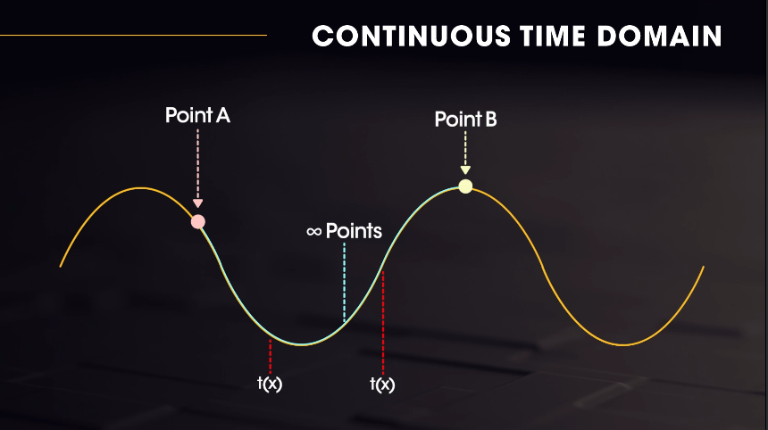

**Discrete Time Domain –** Digital waveforms are discrete, so they hold a finite amount of information. Digital waveforms are recreations, or mere representations of their analog counterparts. It is physically impossible to represent the signal continuously, so instead we represent it as a discrete value at specific time intervals. Between two points A and B, we only have information that has been recorded at specific time intervals, no more, no less.

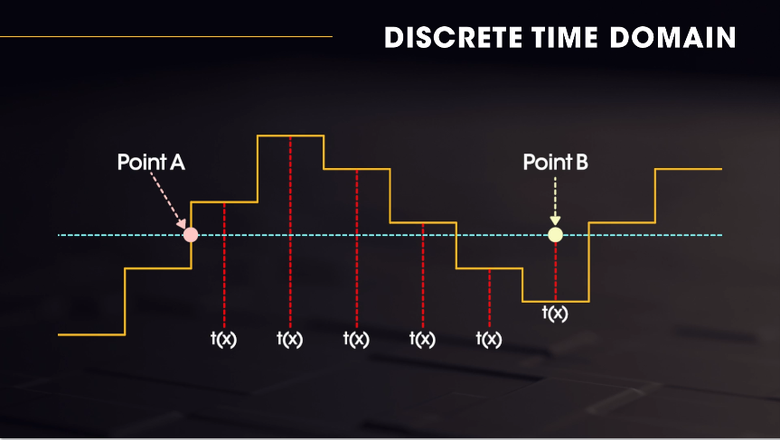

This brings us to sampling theory and analog to digital conversion. How are we taking in discrete digital signals when working with audio? For example, let's say we're talking out loud in a room with a microphone in front of us. The human voice generates a continuous time signal which the mic picks up and converts to a continuous analog electrical signal, which is sent to the computer. The computer samples the signal at regular intervals (this is the A → D conversion).

Additionally vocabulary ...

**Sampling Rate:** Number of samples collected each second, which can be used to represent a soundwave digitally. The most common sample rate is 44.1kHz. For every 1 second of audio, there are 44,100 discrete samples which describe the value of each position of time inside of that signal. This number comes from the _Nyquist Shannon Sampling Theorem._ It states that in order to digitally store and reconstruct a signal, the sample rate of that signal must be at least double the highest frequency within the sampled signal. The human hearing range is considered to be between 20Hz to 22.5kHz, therefore we need to be sampling at a minimum of 44.1kHz without any frequency loss.

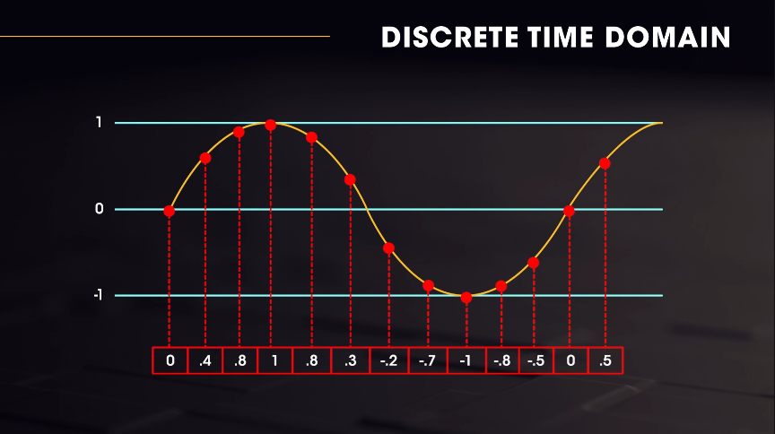

**Block Sizes / Buffer:** Our audio applications can't simply take audio in and output it. They need to accomodate for other inputs as well (like MIDI controllers). Generally, it is known that having smaller block sizes means less latency when playing a MIDI keyboard, but why? Block size determines how many samples of the current smapling rate are processed at once. Think about this, if all our apps did was process incoming samples, it would have no time to check for MIDI or other incoming signals. We break up the process of the sample rate, by assigning a block size to the audio processing operation. The most commonly used sample rate is 512. When an audio plugin is running at a sampling rate of 44.1kHz and a 512 block size, it means that every second 44,100 samples of audio data is being processed. Within that one second of processing, the 44,100 samples are broken down into blocks of 512. The more audio that the processor can go through at once, the faster the process block will happen, because the processing has no interruptions. The block size of 512 means that every 512 samples, the audio engine will stop processing audio to do other things, like checking for MIDI or audio inputs. This is why block size extremely important in live settings, because the input needs to have minimum latency for the musician to feel the responsiveness of their MIDI instrument. When the block size is larger, there is more latency, but the overall CPU usage of the process is lessened.

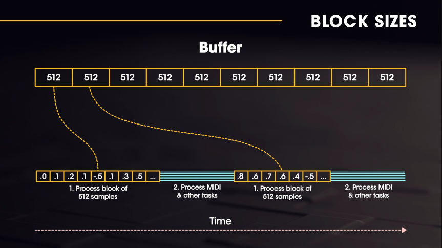

Here is Ableton Live 10's Audio Preferences panel where we can see the Sample Rate and Buffer Size in action.

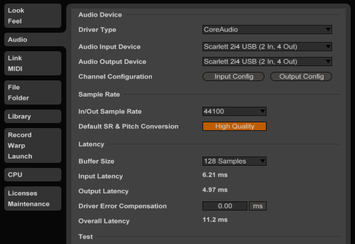

---

## JUCE

JUCE is a C++ toolkit to create cross-platform audio plugins (native or VST/AAX/Audio Unit formats) and GUI applications.

[JUCE](https://juce.com/)

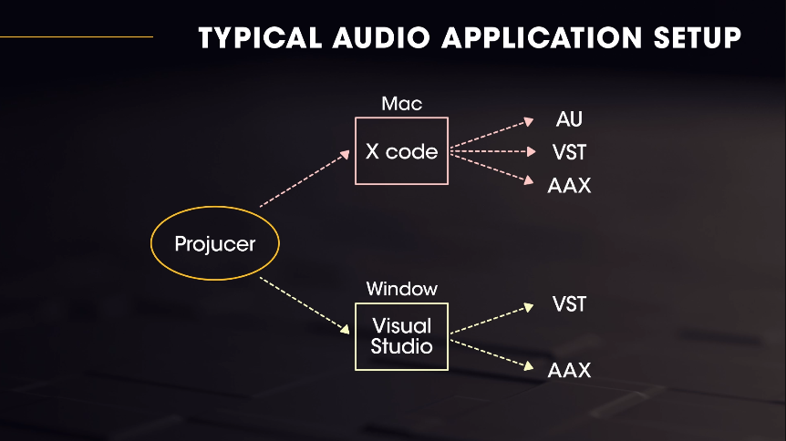

The Projucer is an IDE tool for creating and managing JUCE projects and allows configuration of project settings. When the files and settings for a JUCE project have been specified, the Projucer automatically generates a collection of 3rd-party project files to allow the project to be compiled natively on each target platform. It can currently generate Xcode projects, Visual Studio projects, Linux Makefiles, Android Ant builds and CodeBlocks projects. As well as providing a way to manage a project's files and settings, it also has a code editor, an integrated GUI editor, wizards for creating new projects and files, and a live coding engine useful for user interface design.

---

## Plugin Architecture

Threads are a very common topic when it comes to programming audio plugins.

> In computer science, a thread of execution is the smallest sequence of programmed instructions that can be managed independently by a scheduler, which is typically a part of the operating system. The implementation of threads and processes differs between operating systems, but in most cases a thread is a component of a process.

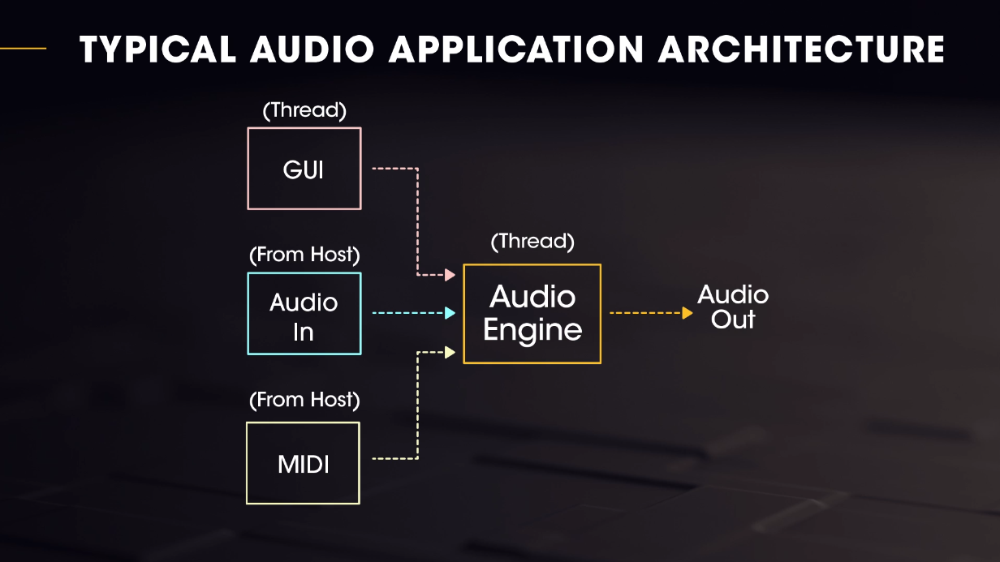

In the diagram above, we see two objects labeled as threads. The highest priority is Audio Thread. The audio plugin typically runs on two threads because the UI and the audio engine need to be completely separate. The audio engine must never sacrifice its processing for the UI. In fact, it shouldn't even be aware that the UI exists. There are many good practices to follow when dealing with multi-threaded audio based applications, but the main goal is our audio engine should never be blocked from running fast and efficiently. This means that we must abide by and be sure to follow on our audio thread.

[Ross Bencina](http://www.rossbencina.com/code/real-time-audio-programming-101-time-waits-for-nothing)

Ross Bencia's rules of thumb or real-time audio callback programming:

- Don't allocate or de-allocate memory.
- Don't lock a mutex.
- Don't read or write to the file system or otherwise perform I/O.
- Don't execute any code that has unpredictable or poor worst-case timing behavior.
- Don't call any code that may violate the rules established above.

---

## JUCE: Parameters, Components & Listeners

We can create an Audio Plugin through Projucer, and open the project in Xcode. We can choose the active scheme (VST, Audio Unit etc), and select an executable in the 'Run' pane of the Scheme Editor. Choosing Ableton Live will execute Live once Xcode finishes building the application. We can then drag that plugin into a blank track to see it run Live! Note that in High Sierra there is a known issue for detecting these plugins. A quick restart should fix it!

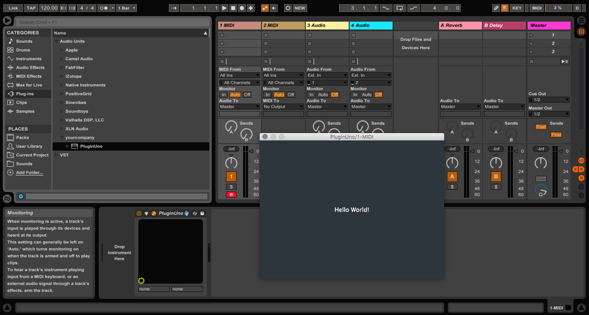

Evaluating the directory structure of the source code, we see:

    BasicGain/Source
    ├── PluginEditor.cpp
    ├── PluginEditor.h
    ├── PluginProcessor.cpp
    └── PluginProcessor.h

Here, we see two files (.h and .cpp combined) representing the two threads we discussed earlier. `PluginEditor` is the GUI, `PluginProcessor` is the audio engine. JUCE handles the creation of both of these classes. To disable the GUI, we can return false on these two implementations:

```cpp
bool BasicGainAudioProcessor::hasEditor() const {
    return false; // (change this to false if you choose to not supply an editor)
}

AudioProcessorEditor* BasicGainAudioProcessor::createEditor() {
    // return new BasicGainAudioProcessorEditor (*this);
        return nullptr;
}
```

Our application does not need a UI to function. This relates back to the necessary independence of the application's UI and audio thread. When the UI is closed, it's fully deleted. This means if the audio thread is referencing the UI, it will crash the application. It's best to focus on the `PluginProcessor` for now.

### PluginProcessor: `processBlock()`

We see that our `PluginProcessor` inherits from the base class `AudioProcessor:`

```cpp
class BasicGainAudioProcessor  : public AudioProcessor {
    // ... header definitions omitted
}

// In juce_AudioProcessor.h

//==============================================================================
/**
    Base class for audio processing classes or plugins.

    This is intended to act as a base class of audio processor that is general enough
    to be wrapped as a VST, AU, RTAS, etc, or used internally.

    It is also used by the plugin hosting code as the wrapper around an instance
    of a loaded plugin.

    You should derive your own class from this base class, and if you're building a
    plugin, you should implement a global function called createPluginFilter() which
    creates and returns a new instance of your subclass.

    @tags{Audio}
*/
class JUCE_API  AudioProcessor {}
```

The `AudioProcessor` is the base class we should use as a jumping point for our plugin. The most important functions for audio processing are `processBlock` and `prepareToPlay`.

`void prepareToPlay(double sampleRate, int samplesPerBlock)` is a function that gets called for pre-playback initialization. It's likely that we'll change our setup to account for buffer size and sample rates in the host DAW.

`void processBlock(AudioBuffer<float>&, MidiBuffer&)` is where the true audio processing happens. This is where we'll write most of the DSP functions.

Since we're focusing on creating a basic audio effect and not a synthesizer, we're going to focus on the `AudioBuffer` JUCE class. The `AudioBuffer` is the audio coming in from the DAW, it's our responsibility to quickly process and return this data to our host by finishing our function in time. The AudioBuffer is a discrete signal stored as floating point values inside the computer. Thus, `AudioBuffer` class is simply a wrapper around an array of floating point values which represent the audio signal, with each point representing the position of the waveform in time. How may we manipulate the volume of the signal?

```cpp
// Inside processBlock...
// Iterate through the number of channels, (typically 2)
for (int channel = 0; channel < totalNumInputChannels; ++channel) {
    float* channelData = buffer.getWritePointer (channel);

        // Run through the buffer and multiply each sample by half to halve the volume
    for (int sample = 0; sample < buffer.getNumSamples(); sample++) {
        channelData[sample] *= 0.5;
    }
}
```

Running this will simply reduce the volume of the audio signal by half, which is hardly useful since it's hardcoded. It's better to make it a gain knob that can be controlled by the user.

To create a native audio parameter, we declare in our processor's header `AudioParameterFloat* mGainParam;` which notifies the host that this is a controllable parameter. We could make a float scoped to the processBlock routine, but that wouldn't expose the parameter to the user for automation. `AudioParameterFloat` is a way of declaring a parameter that makes the host aware of the parameter! We must now construct the parameter and register it inside of the application constructor like so:

```cpp
BasicGainAudioProcessor::BasicGainAudioProcessor() {
        addParameter(mGainParam = new AudioParameterFloat("gain", "Gain", 0.0f, 1.0f, 0.5f));
}
```

Now that we've added and initialized the parameter, we can access it inside of our `processBlock`. So instead of multiplying each sample of the buffer by 0.5, we multiply it by the gain parameter we just created:

```cpp
channelData[sample] *= mGainParam->get();
```

Now we can see that it registered inside the host! We've got a controllable value. Thanks to the JUCE API, we've got a complex interaction with the host wrapped into an abstracted `AudioParameter` class. We can now adjust the gain knob supplied the host without any sort of GUI. Hooray.

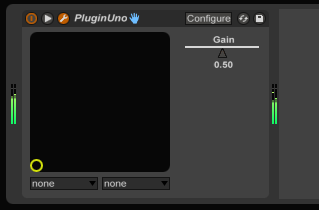

Another common issue when working with digital audio is discontinuities. Discontinuities occur when a change in the signal is so great that it creates a step (and a click) in the waveform. Currently with the gain knob, we can hear slight crackles and pops in the output as we change the value quickly. This is because the gain parameter is being immediately set to the parameter value at whatever rate the parameter is being edited. We always want our parameter value to be snappy and responsive, but it isn't necessarily what we want to apply direct to the audio signal. What we really want to do is set our gain parameter as a target volume, and smoothly travel to the value in a relatively short amount of time (enough to be imperceptible). This is called signal smoothing and is a very important concept in digital audio. We'll use a new audio processor variable `mGainSmooth` to smoothly change our audio signal's volume to the target gain parameter:

```cpp
// x = smoothedvalue, y = targetValue, z = scalar (speed)
// x = x - z * (x - y)

gainSmoothed = gainSmoothed - scalar * (gainSmoothed - targetGain)
```

We'll also avoid iterating through the two channels since we want to change the signal simulatenously. Removing the outer for loop and accessing the stereo channels directly, we can modify their signal at the same time. We'll also use a small scalar to ensure the smoothing is granular. In action, that looks like:

```cpp
float* channelLeft = buffer.getWritePointer(0);
float* channelRight = buffer.getWritePointer(1);

for (int sample = 0; sample < buffer.getNumSamples(); sample++) {
    mGainSmoothed = mGainSmoothed - 0.004 * (mGainSmoothed - mGainParam->get());

    channelLeft[sample] *= mGainSmoothed;
    channelRight[sample] *= mGainSmoothed;
}
```

### Adding UI

The core of the JUCE GUI framework relies on the `Component` class. Evaluate the `juce_Component.h` header to see all functionality provided. Everything on the screen inherits from this class, including the `PluginEditor`, the GUI of our plugin. The JUCE SDK folder has tons of examples, let's run the `DemoRunner` to examine all the included components.

In order to add a slider to our GUI, we can declare a member variable `mGainControlSlider` of data type `Slider` and initialize in our Editor class's constructor.

```cpp
// In PluginEditor.h
Slider mGainControlSlider;

// In PluginEditor.cpp constructor after setting window size
mGainControlSlider.setBounds(0, 0, 100, 100);
mGainControlSlider.setSliderStyle(Slider::SliderStyle::RotaryVerticalDrag);
mGainControlSlider.setTextBoxStyle(Slider::NoTextBox, true, 0, 0);
addAndMakeVisible(mGainControlSlider);
```

### Connecting a GUI component to an AudioParameter

JUCE's listener pattern is quite similar to the popular _Observer Pattern_. It addresses the following problems:

- A one-to-many dependency between many objects should be defined without making the objects tightly coupled.
- It should be ensured that when one object changes state, an open-ended number of dependent objects are updated automatically.
- It should be possible that one object can notify an open-ended number of other objects.

We'll inherit from the JUCE `Listener` abstract class when defining our Component classes. Since C++ allows multiple inheritance, we don't have to resort to interfaces, but the functionality is similar. For example, the below definition will force us to override the `sliderDidChange` virtual function in our implementation file. We'll then register the actual listener in the editor's constructor `mGainControlSlider.addListener(this);`

```cpp
// In header
class BasicGainAudioProcessorEditor  : public AudioProcessorEditor, public Slider::Listener {
public:
        // ... Stuff!
        // ...
        void sliderValueChanged (Slider* slider) override;
}

// In implementation file
void BasicGainAudioProcessorEditor::sliderValueChanged(Slider *slider) {
    if (slider == &mGainControlSlider) {
        DBG("Slider value changed.");
    }
}
```

In order to access the actual gain `AudioParameter` inside the `PluginProcessor`, we'll need to define a pointer for it and set its value like so:

```cpp
// Cast the base AudioParameter class to a float from the 0th index of the parameter array
AudioParameterFloat* gainParameter = (AudioParameterFloat*)params.getUnchecked(0);
*gainParameter = mGainControlSlider.getValue();
```

We also need to set some more intial state for the slide in our Editor constructor. NOTE: You should avoid printing from the Process block, but it's fine for debugging.

```cpp
auto& params = processor.getParameters();
AudioParameterFloat* gainParam = (AudioParameterFloat*)params.getUnchecked(0);
mGainControlSlider.setRange(gainParam->range.start, gainParam->range.end);
```

Instead of registering listeners, we can just write in lambdas for the desired events, which can be more flexible. So it's okay to remove the `Listener` subclass from the Editor's definition file and instead assign a lambda in the constructor of the `PluginEditor` like so:

```cpp
mGainControlSlider.onValueChange = [this, gainParam] {
    *gainParam = mGainControlSlider.getValue();
};

// Implement the other listeners for robustness
// This is going to ensure that this function works well in all DAWs
mGainControlSlider.onDragStart = [gainParam] {
    gainParam->beginChangeGesture();
};

mGainControlSlider.onDragEnd = [gainParam] {
    (*gainParam).endChangeGesture();
};
```

---

## Delays, Circular Buffers & Interpolation

> Delay is an audio effect and an effects unit which records an input signal to an audio storage medium, and then plays it back after a period of time. The delayed signal may either be played back multiple times, or played back into the recording again, to create the sound of a repeating, decaying echo.

[Delay Lines](https://www.music.mcgill.ca/~gary/618/week1/delayline.html)

In the analog world, this is a tricky circuit, which requires a series of capacitors charging and emptying to delay the signal. In the digital world, we're lucky that this is much simpler. Let's examine a DSP block diagram for delay:

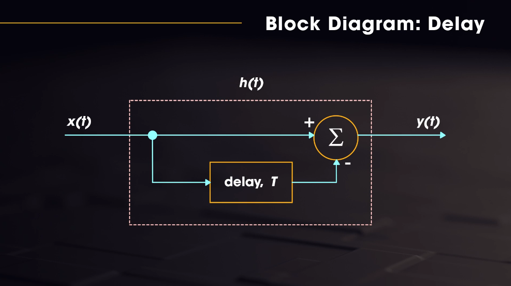

`x(t)` is the input, while `y(t)` is the output. Inside of the block, `x(t)` is sent to 2 places: a block which delays the signal by time `t`, this is the audio storage, and a summation stage where the input signal and delayed signal are summed. This is a rudimentary delay that lacks any feedback or filtering, but is the simplest startest point.

For storing our audio signal, we'll hold it in a data structure known as circular buffer, which will continually be filled with audio data. When we run out of space in the buffer, our delayed signal should have already been played back, thus making it safe to overwrite it with new data. This type of buffer is heavily used in digital audio systems. This single, fixed-size buffer is connected end-to-end, which lends itself nicely to buffering data streams.

### Circular Buffer

We'll create an array of floats to hold our input audio signal. The length of the buffer needs to be long enough to handle our longest desired delay time. How do we determine the amount of floats that is?

If our sample rate is 44.1kHz, theres 44.1k samples of audio streaming a second. If we want 2 seconds to be our max delay time, the equation for our delay time length is:

```cpp
CircularBufferSize = sampleRate * maxDelayTime
```

Where do we allocate the size for this buffer? `prepareToPlay` to the rescue! That's the initialization block. We'll also assign some other variables to keep track of things:

```cpp
float* mCircularBufferLeft;
float* mCircularBufferRight;
int mCircularBufferWriteHead;
int mCircularBufferLength;

// In the Processor's constructor, init them to null pointers.
mCircularBufferLeft = nullptr;
mCircularBufferRight = nullptr;
mCircularBufferWriteHead = 0;
mCircularBufferLength = 0;
```

Because our `prepareToPlay` block takes a sampleRate as an argument, we can assign the right size for the buffer there, and initialize our write head as well.

```cpp
void BasicDelayAudioProcessor::prepareToPlay (double sampleRate, int samplesPerBlock) {
    mCircularBufferWriteHead = 0;
    mCircularBufferLength = sampleRate * MAX_DELAY_TIME;

    if (mCircularBufferLeft == nullptr) {
        mCircularBufferLeft = new float[mCircularBufferLength];
    }

    if (mCircularBufferRight == nullptr) {
        mCircularBufferRight = new float[mCircularBufferLength];
    }
}
```

Be sure to de-allocate the memory properly in our destructor:

```cpp
BasicDelayAudioProcessor::~BasicDelayAudioProcessor() {
    if (mCircularBufferLeft != nullptr) {
        delete [] mCircularBufferLeft;
        mCircularBufferLeft = nullptr;
    }

    if (mCircularBufferRight != nullptr) {
        delete [] mCircularBufferRight;
        mCircularBufferRight = nullptr;
    }
}
```

Then, we'll go ahead and fill out our `processBlock()` with the storage operation. We need to ensure that our write head gets reset once it reaches the bounds of the buffer.

```cpp
float* leftChannel = buffer.getWritePointer(0);
float* rightChannel = buffer.getWritePointer(1);

for (int i = 0; i < buffer.getNumSamples(); i++) {
    mCircularBufferLeft[mCircularBufferWriteHead] = leftChannel[i];
    mCircularBufferRight[mCircularBufferWriteHead] = rightChannel[i];

    mCircularBufferWriteHead++;

        if (mCircularBufferWriteHead >= mCircularBufferLength) {
        mCircularBufferWriteHead = 0;
    }
}
```

This concludes the first part of the block diagram, the storage itself. To read from the storage buffer, we want to read from the circular buffer in a position from behind the write head, which lines up with the time and samples of our delay. The equation for determining the position is the same as finding the max size of the buffer:

```cpp
delayLength = sampleRate * delayTimeSeconds
```

So, we take the current buffer, store it into our circular buffers, and read it with out read head which is slightly delayed. That data gets written back into the main audio buffer, thus introducing the new delayed sound. Our process block now looks like:

```cpp
for (int i = 0; i < buffer.getNumSamples(); i++) {
    mCircularBufferLeft[mCircularBufferWriteHead] = leftChannel[i];
    mCircularBufferRight[mCircularBufferWriteHead] = rightChannel[i];

    mDelayReadHead = mCircularBufferWriteHead - mDelayTimeInSamples;

    if (mDelayReadHead < 0) {
        mDelayReadHead += mCircularBufferLength;
    }

        // Write back into the sample with the half-second delayed signal
    buffer.addSample(0, i, mCircularBufferLeft[(int) mDelayReadHead]);
    buffer.addSample(1, i, mCircularBufferRight[(int) mDelayReadHead]);

    mCircularBufferWriteHead++;

    if (mCircularBufferWriteHead >= mCircularBufferLength) {
        mCircularBufferWriteHead = 0;
    }
}
```

In order to add feedback, we need to revisit the block diagram.

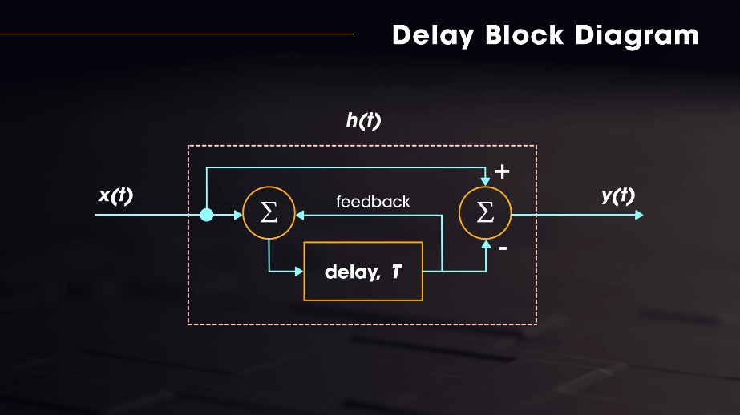

We need to take the output and feed it back into the system, how wouldn't this cause a feedback loop if it never dies? We can expose that control to the user, so the feedback repeat gets quieter and quieter every iteration, until it eventually dies. This means, our processBlock is actually going read from the circular buffer, multiply it by the feedback value, and then write that into the buffer. Because the feedback is less than 1.0, it will _eventually_ decay!

```cpp
// ...
float delaySampleLeft = mCircularBufferLeft[(int) mDelayReadHead];
float delaySampleRight = mCircularBufferRight[(int) mDelayReadHead];

mFeedbackLeft = delaySampleLeft * 0.8;
mFeedbackRight = delaySampleRight * 0.8;

mCircularBufferWriteHead++;

// Write back into the sample with the half-second delayed signal
buffer.addSample(0, i, delaySampleLeft);
buffer.addSample(1, i, delaySampleRight);
```

This gives us feedback, but it isn't the ideal way to mix signals together. We need to have a dry wet control that can be determined by the user. We'll multiply the input by the dry amount and the output by the wet amount, and sum them together.

This leads us to adding a bunch of GUI components in the `PluginEditor`.

```cpp
// Header
Slider mDryWetSlider;
Slider mFeedbackSlider;
Slider mDelayTimeSlider;

// Implementation
BasicDelayAudioProcessorEditor::BasicDelayAudioProcessorEditor (BasicDelayAudioProcessor& p) : AudioProcessorEditor (&p), processor (p) {
    // Make sure that before the constructor has finished, you've set the
    // editor's size to whatever you need it to be.
    setSize (400, 300);

    auto& params = processor.getParameters();

    AudioParameterFloat* dryWetParameter = (AudioParameterFloat*)params.getUnchecked(0);

    mDryWetSlider.setBounds(0, 0, 100, 100);
    mDryWetSlider.setSliderStyle(Slider::SliderStyle::RotaryVerticalDrag);
    mDryWetSlider.setTextBoxStyle(Slider::TextEntryBoxPosition::NoTextBox, true, 0, 0);
    mDryWetSlider.setRange(dryWetParameter->range.start, dryWetParameter->range.end);
    mDryWetSlider.setValue(*dryWetParameter);
    addAndMakeVisible(mDryWetSlider);

    mDryWetSlider.onValueChange = [this, dryWetParameter] {
        *dryWetParameter = mDryWetSlider.getValue();
    };

    mDryWetSlider.onDragStart = [dryWetParameter] {
        dryWetParameter->beginChangeGesture();
    };

    mDryWetSlider.onDragEnd = [dryWetParameter] {
        dryWetParameter->endChangeGesture();
    };
}
```

This now binds the `PluginEditor`'s `Slider` components to the `AudioParameterFloat`s in the `PluginProcessor` module.

Every time we create a slider in JUCE we want to:

- Set its size.
- Set its style.
- Set the text box.
- Set the range.
- Set its value.
- Make it visible.
- Register listeners.

We'll want to abstract these tasks into a module tucked away eventually.

### Adding Interpolation

If we test our plugin's processing with a simple sine wave (the purest wave with the least harmonics), it's easy to hear problems that arise due to lack of interpolation. Jumps inside of a delay time are very apparent with lots of pops and crackles. Typically, we want to interpolate between values to avoid such artifacts. We need to sample numbers that exist between indices in the buffer. We need to extract intersample values using interpolation, the simplest one of which is linear interpolation.

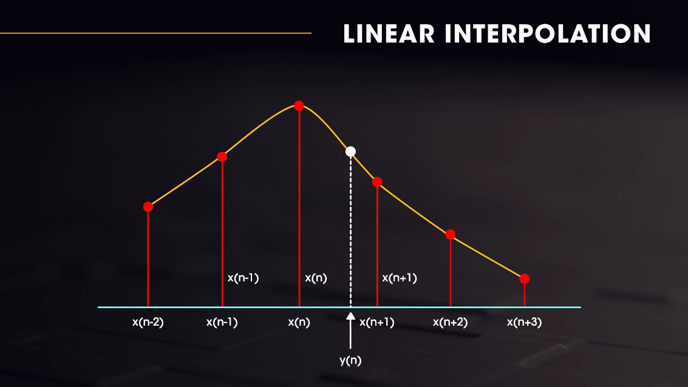

More complex interpolation would use more points to figure out how the intersample value would fit into the curve, but for simplicity's sake, linear interpolation works just fine. It only requires 2 points. We'll want to use a function like `lerp` for such a task, which is widely available in programmatic form on the Internet in many languages.

The technique for integrating lerp into a delay function is to grab the two surrounding indices of our read head, and lerp with the decimal value of the read head.

```cpp
int readHeadX = (int) mDelayReadHead;
int readHeadX1 = readHeadX + 1;

// Extract the decimal value from mDelayReadHead
float readHeadFloat = mDelayReadHead - readHeadX;

if (readHeadX1 >= mCircularBufferLength) {
    readHeadX1 -= mCircularBufferLength;
}

float delaySampleLeft = lerp(mCircularBufferLeft[readHeadX], mCircularBufferLeft[readHeadX1], readHeadFloat);
float delaySampleRight = lerp(mCircularBufferRight[readHeadX], mCircularBufferRight[readHeadX1], readHeadFloat);
```

Even though we only have whole integers to work with when sampling buffers, we can use interpolation to make good guesses at what values exist within these discrete indices. How neat is that?

### Adding a Smooth Read

We have a similar problem with the delay time knob here as well. When analog delays are playing through and the time knob is spun, we get the warbly pitchingshifting effect, which happens because the delay time is shifting into position slowly.

Such an effect is achieved by smoothing the delay time to its final position instead of changing its value instantaneously:

```cpp
mDelayTimeSmoothed = mDelayTimeSmoothed - 0.001 * (mDelayTimeSmoothed - *mDelayTimeParam);
mDelayTimeInSamples = getSampleRate() * mDelayTimeSmoothed;
```

One thing to keep in mind is that in the prepareToPlay block, we should always initialize our buffers to 0 after allocation. The new keyword lets us allocate the appropriate memory, but it's quite possible that it gets instantiated with garbage values in said memory, so we can use a JUCE function to clear that stuff away for us:

```cpp
zeromem(mCircularBufferLeft, mCircularBufferLength * sizeof(float));
zeromem(mCircularBufferRight, mCircularBufferLength * sizeof(float));
```

---

## Chorus, Modulators & Statefulness

Common chorus/flanger controls:

- depth
- rate
- phase offset
- feedback
- dry/wet control
- effect type (chorus vs. flanger)

### Adding an LFO

In order to make an LFO, we first need the equation of the waveform that will become the modulator of another signal. macOS Grapher is a handy tool for visualizing waves.

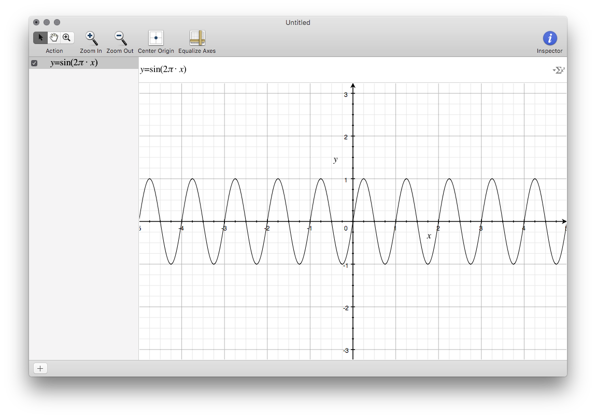

We'll make a new variable to track the phase of our oscillator called `mLFOPhase` in our `PluginProcessor.h` file.

We init to 0 in the constructor and `prepareToPlay` methods as always. In the process block, we'll calculate the LFO output so we can apply it to our time value.

    float lfoOut = sin(2 * M_PI * mLFOPhase);

    mLFOPhase += *mRateParam * getSampleRate();

    // Ensure the LFO phase is bounded between 0 and 1.
    if (mLFOPhase > 1) {
        mLFOPhase -= 1;
    }

    // Map the LFO value to a range of time values (5 - 30ms)
    float lfoOutMapped = jmap(lfoOut, -1.0f, 1.0f, 0.005f, 0.03f);

    mDelayTimeSmoothed = mDelayTimeSmoothed - 0.001 * (mDelayTimeSmoothed - lfoOutMapped);
    mDelayTimeInSamples = getSampleRate() * mDelayTimeSmoothed;

The smoothing doesn't matter as much for sine waves, but for other jagged waves it ensures that there's no clicks or pops in the output.

### Adding Depth

Adding a depth parameter to the LFO is as simple as multiplying the lfoOut by the depth parameter's value.

    lfoOut *= *mDepthParam;

### Adding Phase Offset + Flanger

Phase Offset lets us add a lot of width to the sound. We want to make the left and right channels go out of phase with each other. Right now, they're both in phase. In order to offset the phase, we'll have to generate the left and right LFO outputs separetely.

```cpp
float lfoOutLeft = sin(2 * M_PI * mLFOPhase);
float lfoPhaseRight = mLFOPhase + *mPhaseOffsetParam;

if (lfoPhaseRight > 1) {
    lfoPhaseRight -= 1;
}

float lfoOutRight = sin(2 * M_PI * lfoPhaseRight);

lfoOutLeft *= *mDepthParam;
lfoOutRight *= *mDepthParam;

float lfoOutMappedLeft = 0;
float lfoOutMappedRight = 0;

// Chorus Effect
if (*mTypeParam == 0) {
    lfoOutMappedLeft = jmap(lfoOutLeft, -1.0f, 1.0f, 0.005f, 0.03f);
    lfoOutMappedRight = jmap(lfoOutRight, -1.0f, 1.0f, 0.005f, 0.03f);
} else {
    // Flanger Effect
    lfoOutMappedLeft = jmap(lfoOutLeft, -1.0f, 1.0f, 0.001f, 0.005f);
    lfoOutMappedRight = jmap(lfoOutRight, -1.0f, 1.0f, 0.001f, 0.005f);
}

// Map the LFO value to a range of time values (5 - 30ms)
float delayTimeSamplesLeft = getSampleRate() * lfoOutMappedLeft;
float delayTimeSamplesRight = getSampleRate() * lfoOutMappedRight;
```

A flanger and chorus are pretty much the same effect, with the only difference being in delay time.

### Adding State

The Processor header holds the interface for saving state:

```cpp
void getStateInformation (MemoryBlock& destData) override;
void setStateInformation (const void* data, int sizeInBytes) override;
```

These are usually called when the host DAW saves the project, or could happen in the background for auto saving purposes. When the host calls it, we need to give all the current settings of the plugin to the host, and when the block is handed back to the plugin, load it all back up. JUCE has an XML class to help us do this.

We'll serialize to XML in the `getStateInformation` method of our `PluginProcessor`. We'll populate a memory black that comes the DAW.

```cpp
void BasicChorusFlangerAudioProcessor::getStateInformation (MemoryBlock& destData) {
    // You should use this method to store your parameters in the memory block.
    // You could do that either as raw data, or use the XML or ValueTree classes
    // as intermediaries to make it easy to save and load complex data.

    std::unique_ptr<XmlElement> xml(new XmlElement("ChorusFlanger"));

    xml->setAttribute("DryWet", *mDryWetParam);
    xml->setAttribute("Depth", *mDepthParam);
    xml->setAttribute("Rate", *mRateParam);
    xml->setAttribute("PhaseOffset", *mPhaseOffsetParam);
    xml->setAttribute("Feedback", *mFeedbackParam);

    copyXmlToBinary(*xml, destData);
}
```

Reloading it back from the DAW is as simple as:

```cpp
void BasicChorusFlangerAudioProcessor::setStateInformation (const void* data, int sizeInBytes) {
    // You should use this method to restore your parameters from this memory block,
    // whose contents will have been created by the getStateInformation() call.

    std::unique_ptr<XmlElement> xml(getXmlFromBinary(data, sizeInBytes));

    if (xml.get() != nullptr && xml->hasTagName("ChorusFlanger")) {
        *mDryWetParam = xml->getDoubleAttribute("DryWet");
        *mDepthParam = xml->getDoubleAttribute("DryWet");
        *mRateParam = xml->getDoubleAttribute("DryWet");
        *mPhaseOffsetParam = xml->getDoubleAttribute("PhaseOffset");
        *mFeedbackParam = xml->getDoubleAttribute("Feedback");

        *mTypeParam = xml->getIntAttribute("Type");
    }
}
```

And there we have it:


